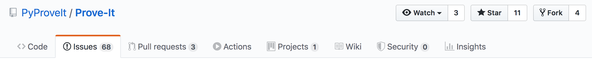
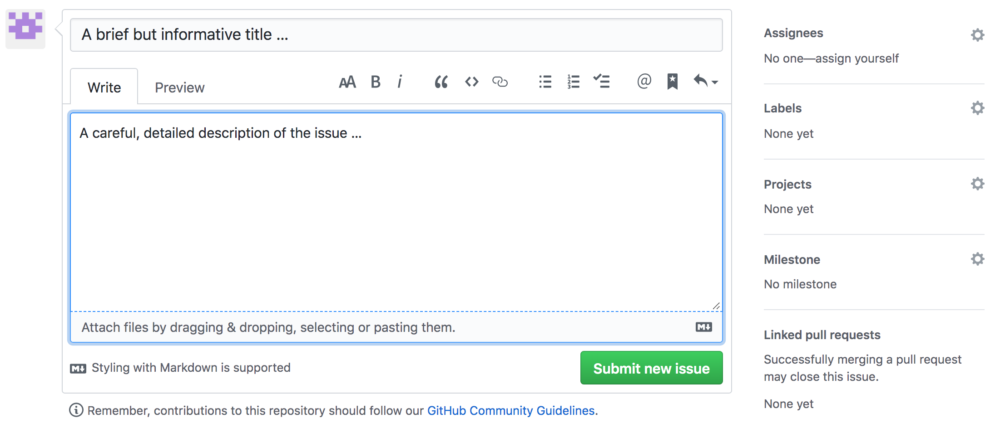
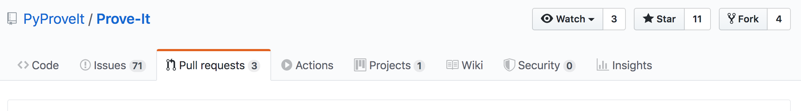
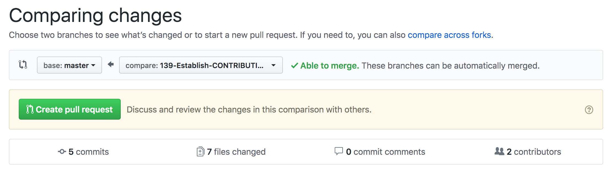
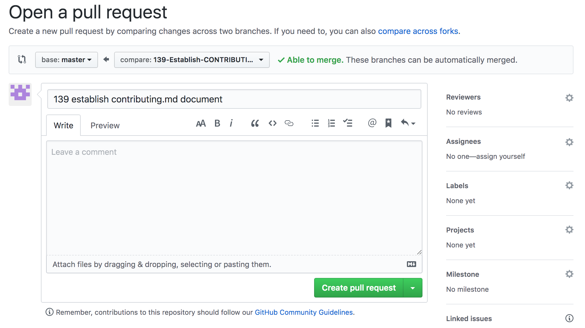

# Contributing to Prove-It

<font size=3>Thanks for considering contributing to Prove-It, a Python- and
Jupiter Notebook-based theorem-proving assistant.

This is a general guide for contributing to Prove-It via the project's
GitHub repository at <https://github.com/PyProveIt/Prove-It> using
issues, branches, pull requests, Kanban board, etc. This document mostly
consists of guidelines instead of hard and fast rules. After reviewing the
guidelines, use your best judgment. Feel free to propose changes to this
document via a repo issue (see the ''Creating Issues'' section below), and
feel free to make inquiries about the project and possible contributions by
contacting Wayne Witzel at wwitzel@sandia.gov.
</font>

## Contents
<font size=3>

[How to Contribute](#how-to-contribute)

   * [Ask a Question](#ask-a-question)
   * [Report a Bug](#report-a-bug)
   * [Suggest a Feature or Enhancement](#suggest-a-feature-or-enhancement)
   * [Contribute Code](#contribute-code)

[Code of Conduct](#code-of-conduct)

[Cosmetic Changes](#cosmetic-changes)

[General Workflow](#general-workflow)

[Opening an Issue](#opening-an-issue)
   
   * [Markdown](#markdown)
   * [Issue Template](#issue-template)
   * [Related Issues](#related-issues)
   * [Labels](#labels)

[Working Issues](#working-issues)
   *  [Planning Work](#planning-work)
   *  [When Work Begins](#when-work-begins)
   *  [As Work Continues](#as-work-continues)
      * [Python Code](#python-code)
      * [Jupyter Notebooks](#jupyter-notebooks)
      * [Commit Messages](#commit-messages)
   *  [When Work is Complete](#when-work-is-complete)
   *  [Closing Old Issues](#closing-old-issues)

[Pull Requests](#pull-requests)
   1. [Reviewers](#reviewers)
   1. [Work-in-Progress](#work-in-progress)
   1. [Merging](#merging)

</font>

## How to Contribute

<div style="margin:0px 0.5in;">

<font size=3>There are a variety of ways to contribute to the Prove-It
project:<b>

[Ask a Question](#ask-a-question)

[Report a Bug](#report-a-bug)

[Suggest a Feature or Enhancement](#suggest-a-feature-or-enhancement)

[Contribute Code](#contribute-code)

</b></font></div>
   
## Code of Conduct

<font size=3>The Prove-It project and its participants are governed by the
project's [Code of Conduct](CODE_OF_CONDUCT.md), which helps make explicit the
expectations for a productive and respectful project community. Participants
and contributions are expected to uphold this code of conduct and to uphold
the more general
[GitHub Community Guidelines](https://help.github.com/en/github/site-policy/github-community-guidelines).
Please report unacceptable behavior to wwitzel@sandia.gov.</font>

## Ask a Question

<font size=3>Just want to ask a question? Consider
[opening an issue](#opening-an-issue) or sending your question along to
Wayne&nbsp;Witzel at wwitzel@sandia.gov. Opening an issue is helpful because
it will allow multiple project developers to view and respond to your question.
</font>

## Report a Bug

<font size=3>To report a bug or suspected bug, see the "Report a Bug" section
under [opening an issue](#opening-an-issue).
</font>

## Suggest a Feature or Enhancement

<font size=3>To suggest a new feature or enhancement, see the "Feature or
Enhancement Requests" section under [opening an issue](#opening-an-issue).
</font>

## Contribute Code

<font size=3>To contribute changes to the project in the form of python code
or python-based Jupyter notebooks, and an eventual merge/pull request, be sure
to begin with opening an Issue (see the "Feature or Enhancement Requests"
section under [opening an issue](#opening-an-issue)). This allows you to verify,
before embarking on any significant work, that your proposed changes mesh with
the developers' vision and are something that the project's developers will
eventually want to merge into the project.
</font>

## Cosmetic Changes

<font size=3>Contributions that consist *solely* of cosmetic changes
(for example, changes in style or formatting, or updating code format to
comply with PEP8) are generally discouraged. For some possible insights into
the motivation for such a policy, consider this
[related comment at the Ruby on Rails project](https://github.com/rails/rails/pull/13771#issuecomment-32746700)
</font>

## General Workflow

<font size=3>For asking a question, reporting a bug, suggesting a
modification, <i>etc.</i>, you can [open an issue](#opening-an-issue) on
the [project's GitHub](https://github.com/PyProveIt/Prove-It) site or
directly email Wayne Witzel at wwitzel@sandia.gov.

For contributions in the form of python code and/or python-based Jupyter
notebooks, your workflow will typically consist of
(1) opening and discussing a related issue on
[Prove-It's GitHub site](https://github.com/PyProveIt/Prove-It);
(2) establishing a corresponding feature or enhancement branch for your work
in your own forked version of the project;
(3) managing the related Kanban board information as you progress in your
feature branch;
(4) testing your work; and
(5) submitting a "work in progress" (WIP) or final pull/merge request.

See elaborations of each of these items discussed further below.
</font> 

## Opening An Issue

<font size=3><div style="margin:0px 0.25in;">

(see
[creating an issue in GitHub](https://help.github.com/en/github/managing-your-work-on-github/creating-an-issue)

To ask a question, report a bug, or suggest a new feature or enhancement,
first review the already-established issues listed on the
[Prove-It GitHub site](https://github.com/PyProveIt/Prove-It/issues).
If your topic is not already covered by an existing issue, open
a new issue on the
[Prove-It GitHub site](https://github.com/PyProveIt/Prove-It/issues)
by selecting the Issues tab:



then clicking on the green <b>New issue</b> button:


If there are multiple issue types, click "Get started" next to the type of
issue you'd like to open, else use the generic Issue submission window that
appears.

Each issue should have a brief but informative title, and a careful,
detailed description of the issue.

### Questions

Questions should provide detailed information so people
will understand what you're asking, why you're asking, and any important
context for the question you're asking. The more detailed and clear you
formulate your question, the more likely you will get an answer, and the
more likely the answer will be useful to you.

### Bug Reports

Bug Reports should provide a detailed description of the buggy
behavior, as well as detailed information about the context in which the
bug appears and the steps someone can take to reproduce the bug. Is the
bug always reproducible, or intermittent? What do you expect to happen
*instead* of the bug behavior? If you have ideas about what might be
producing the behavior and/or how to fix it, consider including such info
in a *separate* detailed paragraph.

### Feature or Enhancement Requests

Feature or Enhancement Requests should also provide as much
information as possible. Consider providing details such as: how the
enhancement fits within the goals and scope of the project; how it connects
to other parts of the project; how it enhances the project. If you have ideas
about how to implement the enhancement, share those ideas, and indicate
clearly if this is work you would like or be willing to attempt youself
as an eventual code contribution.

[↑ Contents](#contents)

### Markdown

Issue comments can use plain text or make use of GitHub-flavored markdown.
[Markdown](https://en.wikipedia.org/wiki/Markdown) is a lightweight markup
language with plain text formatting syntax and GitHub uses a form of it for
rendering issue and merge/pull request comments, and for rendering any files
in your repositories with an `.md` extension (such as this one).
For more details on what's possible with GitHub-flavored Markdown, see the
[GitHub Markdown Guide](https://guides.github.com/features/mastering-markdown/).
Be sure to use the "preview" tab in the issue editing window to preview your
comments and any interpreted text.

[↑ Contents](#contents)

### Related Issues

It can be very useful to indicate related issues when establishing an issue
or commenting on an already-established issue. GitHub's markdown code
facilitates this by interpreting the \# symbol followed by an issue number as
a link to an issue. The issue comment editing window facilitates this process
by opening a pop-up window of possible issues once you type the \# symbol.
For example, in establishing an issue or writing a later comment on an issue,
you might realize that the issue is related to issue \#123 established earlier,
and so it's useful to add a notation such as "Related Issue: \#123", which will
eventually produce a clickable link to that related issue (which can be seen
in the preview mode by clicking on the preview tab).

[↑ Contents](#contents)

### Issue Options for Project Maintainers: Assignees, Labels, Projects

As shown in the figure below, when opening a new issue as a
"project maintainer," a number of options appear along the right-hand side
of the issue submission window. You can assign the issue to one or more people
(including yourself). Then select one or more appropriate labels to classify
the issue (<i>e.g.</i>, "bug", "enhancement", <i>etc</i>.). Then under
"Projects," select "development", which will automatically add the issue to
the "To Do" list on the project's
[Kanban board](https://github.com/PyProveIt/Prove-It/projects/1))
(accessible later by selecting the Projects tab and development option) on
the project's GitHub page.



[↑ Contents](#contents)

</div></font>

## Working Issues

<div style="margin:0px 0.25in;">

### Planning Work

<font size=3>As issues are created by both users and the development team, the issues are
added to the **To&nbsp;Do** column on the project's
[Kanban board](https://github.com/PyProveIt/Prove-It/projects/1).
This is the time and place to further elaborate on an issue, provide more
comments, and solicit others' comments, to ensure an issue has been described
in sufficient detail to allow productive work to begin. When sufficient detail
has been provided, the issue can then be assigned to a user or team member
(if it hasn't already) and then the issue can be dragged into the
**Ready&nbsp;to&nbsp;Work** column.</font>

[↑ Contents](#contents)

### When Work Begins

<font size=3>Once all the necessary information has been gathered and the
assignee has time to work on an issue, it can be dragged into the
**In&nbsp;Development** column on the project's
[Kanban board](https://github.com/PyProveIt/Prove-It/projects/1).

Assuming you have already established your own local repository for the
project (see the project's [README.md](README.md) file for instructions about
downloading and building the project), then before creating a feature branch,
make sure your local `master` branch is up-to-date with
```bash
git checkout master
git pull --ff-only
```
or an equivalent process using GitHub Desktop or other similar program.

> **Note:**  You should never be making commits on your `master` branch, as all
> changes will be making it into `master` via [pull requests](#pull-requests).
> The `--ff-only` flag ensures you only update your local `master` branch if it
> can be fast-forwarded.

Once your local `master` is updated, create a feature or enhancement branch
off of it with

```bash
git checkout -b <branchName>
```
(or an equivalent process using GitHub Desktop or other similar program).
The recommended branch naming convention is to use the issue number,
followed by a hyphen, followed by the issue title, all lowercase, omitting
special characters, and replacing spaces with hyphens.  For example, if you
are creating a feature branch to work on issue number 123, which has
"Implement Awesome New Feature" as the title, the corresponding branch name
would be `123-implement-awesome-new-feature`.

[↑ Contents](#contents)

### As Work Continues

Do whatever work is necessary to address the issue you're tackling. Break your
work into small, logical, compilable commits.  Commit small chunks of
work early and often in your local repository and then eventually use
`git rebase -i` (or your application's equivalent) to reorganize your commits
before sharing.

[↑ Contents](#contents)

<div style="margin:0px 0.25in;">

### Python Code

Prove-It is based on Python and all Python code should conform as much as
possible to the style and format expectations laid out in the Python
Enhancement Proposal (PEP) 8: Style Guide for Python Code, available at
<https://www.python.org/dev/peps/pep-0008/>.

### Jupyter Notebooks

Python-based Jupyter Notebooks (files with extension `.ipynb`) are used to
organize axioms, theorems, and theorem-proving. Such notebooks should …

#### Commit Messages

The first line of the commit message should be a descriptive title, limited
to 50 characters. This is then followed by a blank line, and then the rest
of the commit message is a description of the changes, particularly why they
were made, limited to 72 characters wide. It is better
to err on the side of more-detailed rather than less-detailed commit messages.
Make sure your commit messages reference the appropriate issue numbers using
the `#<issueNumber>` syntax. For example, your work in branch
`123-implement-awesome-new-feature` will be related to Issue \#123, and
perhaps an older issue \#98, so include a reference such as
"Related Issues: \#98, \#123" in your commit message.

For more ideas and guidance on writing good commit messages, consider some
of Bolaji&nbsp;Ayodeji's
[observations and suggestions](https://www.freecodecamp.org/news/writing-good-commit-messages-a-practical-guide/),
which reflect a number of common practices and expectations about git
commit messages.

</div>

### When Work is Complete

When you think your work is finished and ready to be pushed to the remote,
you'll first want to configure, build, and test to make sure it's all working.
Be sure to check that you haven't inserted anything that triggers a compiler
warning, and things of that nature.

While working on your feature in your local repository, other commits likely
made it into the remote `master` branch.  There are a variety of ways to merge
these changes into your local feature branch.  One possibility is

```bash
git checkout master
git pull --ff-only
git checkout <branchName>
git rebase master
```

though there are others that are equally valid. Rebasing with the master
branch can help simplify the eventual commit chain

Once that's done you'll want to configure, build, and test again to make sure
you didn't pull anything in that doesn't work with your changes. From within
your local repository, you will want to verify that the following all
complete without error:

```bash
python build.py --clean
python build.py --justessential
python build.py --justdemos
python build.py --justproofs
```

If all is well, go ahead and [create a pull request](#pull-requests)
(see below), which is the project's GitHub version of a merge request.

[↑ Contents](#contents)

### Closing Old Issues

If you are a project maintainer and you encounter an issue that will not be
worked in the foreseeable future, it is worthwhile to close the issue so that
we can maintain a reasonable backlog of upcoming work.  Do be sure to include
in the comments some explanation as to why the issue won't be addressed.

[↑ Contents](#contents)

</div>

## Pull Requests

<div style="margin:0px 0.25in;">

As a general resource regarding pull requests, consider this discussion
about
[GitHub-related pull requests](https://help.github.com/en/github/collaborating-with-issues-and-pull-requests/about-pull-requests).


The only way changes get into the Prove-It project's `master` is through
pull requests.  When you've completed work on an issue, push your branch to
the remote with `git push -u <remoteName> <branchName>` (or using the
analogous process in GitHub Desktop or other related application), and then
create a pull request on the project's GitHub site
under the [pull requests tab](https://github.com/PyProveIt/Prove-It/pulls):



by clicking the "New pull request" button:


which should then take you to a pull request screen like this:



where you will select base: master on the left and your own branch to
compare on the right. You can then review file and code differences on this
page and eventually click on the "Create pull request" button. That will
take you to a page like this:



where you can leave a detailed comment explaining the pull/merge request and
summarizing the work you've completed, make appropriate updates to the options
shown along the right-hand side, and click on the "Create pull request"
button.

If you have access to the project's
[Kanban board](https://github.com/PyProveIt/Prove-It/projects/1),
drag your issue into "Under Review".

[↑ Contents](#contents)


### Reviewers

We recommend having your pull/merge request reviewed by at least two other team
members. The first should be someone who is knowledgable about the code that
you're changing &mdash; this is to make sure you don't accidentally do
something foolish. The second should be someone who knows little about the
code you're touching &mdash; this is to spread the knowledge of how the code
works throughout the team. Work with your reviewers to get your changes into
an acceptable state.

[↑ Contents](#contents)

### Work-in-Progress

You may wish to have your changes reviewed by colleagues before they are ready
to be merged into `master`.  To do so, create a pull/merge request as usual,
but insert "WIP:" at the beginning of the Title.

[↑ Contents](#contents)

### Merging

When the review is finished and changes are ready to be merged into `master`:
1. Rebase your feature branch on top of the latest `master`.
1. Squash your feature branch down to a single commit.
1. Merge the request.
1. Return to the issue the pull/merge request addressed and update the issue
   with comments about the pull/merge request being submitted.

> **Note:**  The motivation here is we want the code to build and tests to pass
> for every commit that makes it into `master`, and we'd like a history that
> is as linear as possible.  This makes finding problems with `git bisect`
> significantly easier.  However, there may be situations in which you don't
> want to squash down to a single commit.  In such a case, squash down to the
> smallest number of commits that makes sense, ensuring the code builds and
> tests pass for each commit.

[↑ Contents](#contents)

</div>